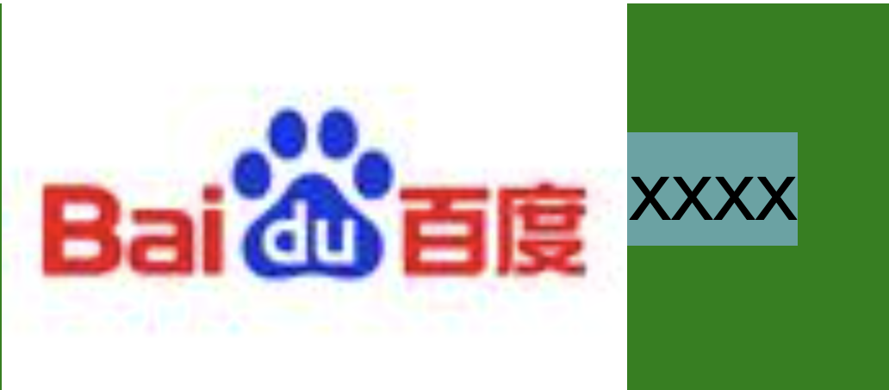

1. 理解`vertical-align`和`line-height`的小细节，[参考链接](https://www.zhangxinxu.com/wordpress/2015/08/css-deep-understand-vertical-align-and-line-height/?shrink=1)
> 总结： 一个`inline-block`元素，如果里面的没有行内元素，或者overflow不为visible，则该元素的基线就是其margin底部的下边缘，否则就是最后一行内联元素的基线
>
> 其它：
> 1. vertical-align的默认值是`baseline`，且它只对行内元素起作用，对块级元素无感
> 2. vertical-align: middle的居中不是绝对的居中，是近似居中，因为是以文本的中线位置情况来的，如下图所示
>
> 
>
> 3. 可用`font-size: 0`来去掉内联元素的空白
> ```css
> /* vertical-align和line-height的联系 */
> {
> 	line-height: 30px; 
> 	vertical-align: -10%;
> }
> /* 等于如下 */
> {
> 	line-height: 30px; 
> 	vertical-align: -3px;
> }
> ```

2. 了解BFC， `block formatting content(块级格式化上下文)`，具有BFC特性的元素可以看作是隔离了的独立容器，容器里面的元素不会在布局上影响到外面的元素，[知乎文章参考](https://zhuanlan.zhihu.com/p/25321647)，[MDN文档参考](https://developer.mozilla.org/zh-CN/docs/Web/CSS/CSS_Flow_Layout/Intro_to_formatting_contexts)
> 只要元素满足下面任一条，即可触发BFC特性
> 1. html根元素（body不行）
> 2. 浮动元素：float 除 none 以外的值
> 3. 绝对定位元素：position (absolute、fixed)
> 4. display 为 inline-block、table-cells、flex
> 5. （🌟 最常用）overflow 除了 visible 以外的值 (hidden、auto、scroll) 
> - BFC特性及应用
> >  1. 同一个 BFC 下外边距会发生折叠
> >  2. BFC 可以包含浮动的元素（清除浮动）
> >  3. BFC 可以阻止元素被浮动元素覆盖

3. 如何让一个div水平垂直居中
```html
<div class="parent">
	<div class="child"></div>
</div>	
```
```css
/* 1. flex布局 */
.parent {
	display: flex;
	align-items: center;
	justify-content: center;
}
/* 或者 */
.parent {
	display: flex;
}
.child {
	margin: auto;
}
/* 2. relative和absolute */
.parent {
	position: relative;
}
.child {
	position: absolute;
	top: 50%;
	left: 50%;
	transform: translate(-50%, -50%);
}
/* 或者 */
.child {
	position: absolute;
	top: 0;
	left: 0;
	right: 0;
	bottom: 0;
	margin: auto;
}
/* 3. grid布局 */
.parent {
	display: grid;
}
.child {
	justify-self: center;
	align-self: center;
}
```
4. 用css画出三条横杠（⚠️主要考察`background-clip`指定背景绘制区域的使用）
```css
/* <div class="demo"></div> */
.demo {
	width: 100px;
	height: 10px;
	padding: 30px 0;
	border-top: 10px solid red;
	border-bottom: 10px solid red;
	background-color: red;
	background-clip: content-box;
}
```

5. 已知如下代码，如何修改让图片宽度变为300px？代码不可修改
> ⚠️ `max-width`会覆盖`width`，`min-width`会覆盖`max-width`， [max-width MDN文档](https://developer.mozilla.org/zh-CN/docs/Web/CSS/max-width)
```html

```
```css
/* 方案1 */
img {
	max-width: 300px;
}
/* 方案2 */
img {
	box-sizing: border-box;
	padding: 50px;
}
/* 方案3 */
img {
	transform: scale(0.75)
}
```

6. css中使用变量
```css
/* 申明变量时，带上--  */
:root {
	--color: #ff0000;
}
/* 注意变量名相同时的优先级问题  */
div {
	--color: #000000;
	color: var(--color);
}
```

7. less、sass善用mixin归类重复样式
```less
.line-camp( @clamp: 2 ) {
  display: -webkit-box;
  text-overflow: -o-ellipsis-lastline;
  overflow: hidden;
  text-overflow: ellipsis;
  -webkit-line-clamp: @clamp;
  -webkit-box-orient: vertical; 
}
.flex-box( @alignItems: 'normal', @justifyCtn: 'normal' ) {
	display: flex;
	align-items: @alignItems;
	justify-content: @justifyCtn;
}
```

8. 实现1px border方案
> 方案1的缺点是`老版本兼容性不太好`，方案2的缺点是`颜色要淡一些`
```css
/* 方案1 使用伪类 + transform */
.border_bottom {
	position: relative;
	overflow: hidden;
	border: none !important;
}
.border_bottom::after {
	display: block;
	content: " ";
	position: absolute;
	left: 0;
	bottom: 0;
	width: 100%;
	height: 1px;
	background: red;
	transform-origin: 0 0;
	tramsform: scaleY(0.5)
}

/* 方案2 使用box-shadow模拟 */
.border_bottom {
/* x偏移量 | y偏移量 | 阴影模糊半径 | 阴影扩散半径 | 阴影颜色 */
	box-shadow: inset 0 -1px 1px -1px red;
}
```

9. `link`和`@import`的区别
> 1. link是HTML标签，@import是css提供的
> 2. 页面加载时，link引入的样式同步加载，@import引入的样式需等加载完成后再加载
> 3. link没有兼容性，@import不兼容ie5以下
> 4. link标签js可引入，@import js不能引入

